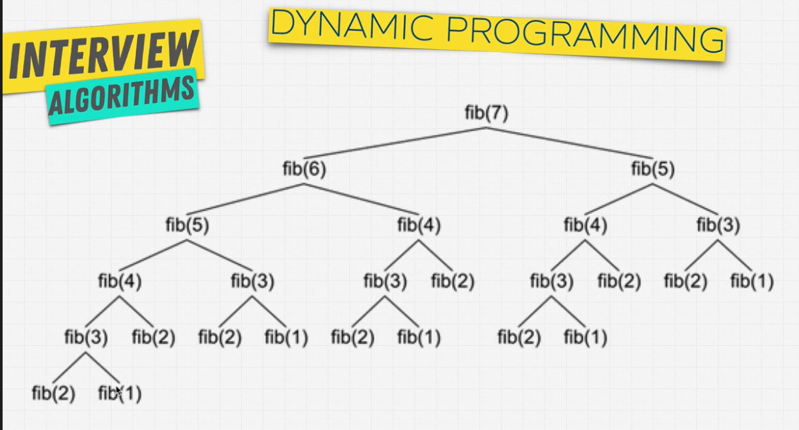
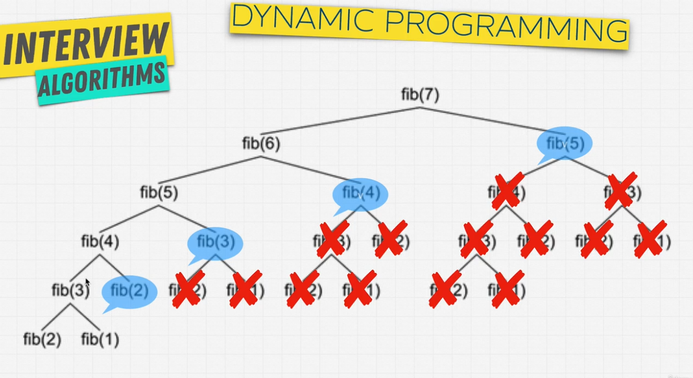

# Dynamic Programming

It is an optimization technique. Using cache, to remember a previously calculated answer. 

Breaking down a large problem into subproblems and storaging their solution.  
When it appears again we already have the anwser.

## Memoization ~~~ Caching

`Dynamic Programming = Divide&Conquer + Memoization`

1. Can be divided into subproblems
2. Recursive solution
3. Are there repetitive subproblems
4. Memoize subproblems

## Fibonacci Tree
See images

DFS, memoized each node into a cache  
No need to repeat calculation, now its just a lookup